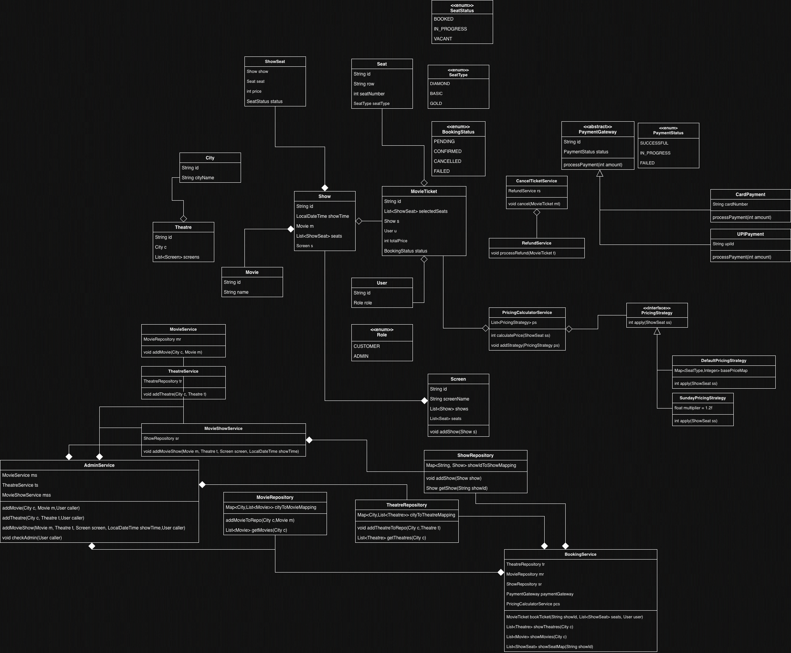

# Book My Show — Low Level Design

A Java implementation of a movie ticket booking system demonstrating core LLD concepts including the Strategy pattern, Repository pattern, and Service layer architecture.

---

## UML Design




## Project Structure

```
src/main/java/org/example/
├── entity/          # Core domain objects
│   ├── City.java
│   ├── Movie.java
│   ├── Theatre.java
│   ├── Screen.java
│   ├── Seat.java
│   ├── Show.java
│   ├── ShowSeat.java
│   ├── MovieTicket.java
│   └── User.java
├── enums/           # State and type enumerations
│   ├── SeatType.java        # DIAMOND, GOLD, BASIC
│   ├── SeatStatus.java      # VACANT, IN_PROGRESS, BOOKED
│   ├── BookingStatus.java   # PENDING, CONFIRMED, CANCELLED, FAILED
│   ├── PaymentStatus.java   # SUCCESSFUL, IN_PROGRESS, FAILED
│   └── UserRole.java        # ADMIN, CUSTOMER
├── payment/         # Payment gateway abstraction
│   ├── PaymentGateway.java  # Abstract base class
│   ├── UPIPayment.java
│   └── CardPayment.java
├── repository/      # In-memory data stores
│   ├── MovieRepository.java
│   ├── TheatreRepository.java
│   └── ShowRepository.java
├── service/         # Business logic
│   ├── AdminService.java
│   ├── BookingService.java
│   ├── CancelTicketService.java
│   ├── MovieService.java
│   ├── MovieShowService.java
│   ├── PricingCalculatorService.java
│   ├── RefundService.java
│   └── TheatreService.java
└── strategy/        # Pricing strategies
    ├── PricingStrategy.java         # Interface
    └── DefaultPricingStrategy.java  # Base price by seat type
```

---

## Run Instructions

### Prerequisites
- Java 17 or higher
- Maven 3.6+

### Steps

1. Clone the repository:
```bash
git clone https://github.com/akshat-code21/book_my_show_lld_impl
cd bms-lld
```

2. Build the project:
```bash
mvn clean compile
```

3. Run the main class:
```bash
mvn exec:java -Dexec.mainClass="org.example.Main"
```

Or run directly from IntelliJ IDEA by opening `Main.java` and clicking the green Run button.

---

## Sample Interaction

The `Main.java` file sets up a complete booking flow end to end. Here is the expected console output:

```
Initiating UPI payment of ₹300 via UPI ID: user@upi
Connecting to UPI gateway...
Payment of ₹300 successful via UPI!
Available seats: 2
Booking status: CONFIRMED
Total price: ₹300
Processing refund of ₹300 for ticket <ticket-id>
Refund successful!
After cancel: CANCELLED
```

---

### Key design decisions

**Strategy pattern for pricing** — `PricingStrategy` is an interface with a single `apply(ShowSeat)` method. `PricingCalculatorService` holds a list of strategies and sums their results, making it easy to compose rules. Adding a new pricing rule (e.g. weekend surcharge) requires only a new class — no existing code changes.

**Abstract `PaymentGateway`** — `CardPayment` and `UPIPayment` extend an abstract class, ensuring any new payment method only needs to implement `processPayment(int amount)`.

**Admin guard** — `AdminService` wraps all admin operations (`addMovie`, `addTheatre`, `addMovieShow`) with a `checkAdmin(User)` call that throws if the caller is not an `ADMIN`, enforcing role-based access at the service layer.

**Concurrency handling** — `bookTicket()` sorts seats by ID before locking and uses `synchronized(ss)` per seat to prevent two users from booking the same seat simultaneously. Seats are set to `IN_PROGRESS` before payment and rolled back to `VACANT` if payment fails.

---

## APIs Implemented

| # | API | Method | Service |
|---|-----|--------|---------|
| 1 | Book a ticket | `bookTicket(showId, seats, user)` | `BookingService` |
| 2 | Show theatres in city | `showTheatres(city)` | `BookingService` |
| 3 | Show movies in city | `showMovies(city)` | `BookingService` |
| 4 | Show seat map for a show | `showSeatMap(showId)` | `BookingService` |
| 5 | Process payment | `processPayment(amount)` | `PaymentGateway` |
| 6 | Cancel ticket | `cancel(ticket)` | `CancelTicketService` |
| 7 | Add movie | `addMovie(city, movie, user)` | `AdminService` |
| 8 | Add theatre | `addTheatre(city, theatre, user)` | `AdminService` |
| 9 | Add movie show | `addMovieShow(movie, theatre, screen, time, user)` | `AdminService` |
